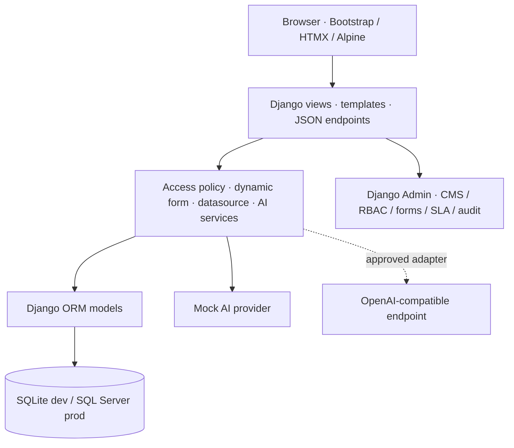

# Greenline Insurance Services (GLIS) Enterprise Platform

GLIS is a bilingual Django 5.2.17 enterprise service platform for insurance customers, hospitals and providers, brokers, insurers, support teams, managers, auditors and administrators. It combines an original corporate public website with a secure authenticated portal, ticket operations, CMS and theme controls, dynamic JSON forms, executable workflow/SLA automation, a knowledge base, audit history and a governed Vanna analytics console.

The implementation intentionally uses Django templates, HTMX and Alpine.js progressive enhancement. It is not a React, Vue, Next.js or SPA project. Operational charts use Plotly only.

## What is included

- Original, responsive public GLIS website with English/Arabic, RTL, light/dark themes and reduced-motion support.
- Django Admin-managed site identity, theme palette, navigation, hero, services, statistics, pages, page sections and safe animation presets.
- Email/password authentication plus django-allauth Google and Microsoft/Azure AD provider support.
- Automatic local profile creation and Guest role assignment for new external users.
- Seven roles: Super Admin, Admin, Project Manager, Support Agent, Requester/User, Viewer/Auditor and Guest.
- Server-side ticket visibility for requester, assignee, project and support-group scope.
- AdminLTE-style portal navigation with full, icon-only and fully hidden modes. The default is icon-only and each user's selection is saved to their profile.
- Working edit, export, secure share, multi-user/multi-group assign/unassign and explicit group-member takeover actions.
- Ticket detail workspace with dynamic fields, sensitive masking, WYSIWYG conversations, pasted images, drag/drop documents, activity, SLA, approvals and AI recommendations.
- Four-step ticket creation with exactly four configurable AI clarification questions.
- JSON-driven form engine with server validation, role visibility/edit rules, conditional visibility/requirements, enum and allowlisted lookup sources.
- Secure datasource registry: editable JSON never executes SQL.
- Dynamic form/version administration with schema validation, publish and activate actions.
- Category-driven default routing, required documents, initial/update email flags, multi-level approvals, auto-close and bounded reopening.
- Executable SLA escalation levels with target users/groups and assignee reporting-manager escalation.
- In-app/browser notification panel for assignments, approvals, SLA escalation and ticket updates.
- Front-end profile/security management for name, email, avatar, organization, title, department, language, theme, notifications and password.
- Governed Vanna conversation workspace with user-scoped session history, append-only follow-up questions, Chroma/Vanna diagnostics, per-query CSV export, and Admin-managed domains, rules, policies, prompts and training.
- Admin-managed public and portal navigation plus bilingual portal pages with publication state and optional group restrictions.
- Versioned CMS content foundations and publish snapshots.
- Mock AI provider, disabled-by-default real-provider interface and AI interaction audit.
- Django service/API layer for tickets, comments, forms, validation, AI analysis and CMS settings.
- Realistic idempotent demo seeding with 24 tickets, roles, teams, comments, internal notes, attachments, SLA conditions and bilingual content.
- SQLite development configuration and SQL Server production configuration through `mssql-django`.

## Architecture



The source is separated by business capability:

| Area | Location | Responsibility |
|---|---|---|
| Configuration | `glis/` | Settings, URLs, ASGI/WSGI |
| Core | `apps/core/` | Module registry, configuration versions, audit logs, API contracts |
| Accounts | `apps/accounts/` | Profiles, roles, external-account policy, social-login adapter |
| CMS | `apps/cms/` | Public content, branding, themes, pages, animations |
| Tickets | `apps/tickets/` | Catalog, groups, tickets, SLA, forms, comments, attachments, wizard |
| Knowledge | `apps/knowledge/` | Bilingual public/internal articles and feedback |
| AI | `apps/ai/` | Provider settings, provider interface and interaction audit |
| Orchestrator | `apps/orchestrator/` | Vanna domains, governance, training memory, gateway adapter and query audits |
| Services | `services/` | Access policy, dynamic form renderer and datasource registry |
| UI | `templates/`, `static/` | Django templates, CSS design system and CSP-compatible JavaScript |

## Quick start

Python 3.12 is recommended.

```bash
python -m venv .venv
```

Activate it:

```powershell
.venv\Scripts\Activate.ps1
```

or on Linux/macOS:

```bash
source .venv/bin/activate
```

Install and initialize:

```bash
pip install -r requirements.txt
copy .env.example .env
python manage.py migrate
python manage.py seed_demo_data
python manage.py runserver
```

On Linux/macOS use `cp .env.example .env` instead of `copy`.

Open:

- Public website: `http://127.0.0.1:8000/`
- Arabic website: `http://127.0.0.1:8000/ar/`
- Portal: `http://127.0.0.1:8000/portal/`
- Administration: `http://127.0.0.1:8000/admin/`

## Demo accounts

All development demo accounts use `DemoAdmin123!`.

| Account | Role |
|---|---|
| `admin@glis.local` | Super Admin |
| `ops.admin@glis.local` | Admin |
| `manager@glis.local` | Project Manager |
| `claims.agent@glis.local` | Support Agent |
| `support.agent@glis.local` | Support Agent |
| `customer@glis.local` | Requester/User |
| `auditor@glis.local` | Viewer/Auditor |
| `guest@glis.local` | Guest |

These credentials are development-only. Delete or rotate all demo accounts before any shared deployment.

## Environment variables

The application defaults to local development mode when `.env` is absent, so a
clean extraction can run immediately. Copy `.env.example` to `.env` before
customizing the configuration:

```bash
# Windows Command Prompt
copy .env.example .env

# PowerShell, Linux or macOS
cp .env.example .env
```

Set at least:

| Variable | Purpose |
|---|---|
| `DJANGO_SECRET_KEY` | Long random production secret |
| `DJANGO_DEBUG` | `True` only for local development |
| `DJANGO_ALLOWED_HOSTS` | Comma-separated application hosts |
| `CSRF_TRUSTED_ORIGINS` | HTTPS origins used behind a proxy |
| `DATABASE_ENGINE` | `sqlite` or `mssql` |
| `DATABASE_NAME` | SQLite filename or SQL Server database |
| `DATABASE_HOST` | SQL Server host |
| `DATABASE_USER` / `DATABASE_PASSWORD` | Least-privilege SQL Server account |
| `DATABASE_DRIVER` | Normally `ODBC Driver 18 for SQL Server` |
| `GOOGLE_CLIENT_ID` / `GOOGLE_CLIENT_SECRET` | Google OAuth application |
| `MICROSOFT_CLIENT_ID` / `MICROSOFT_CLIENT_SECRET` | Microsoft application |
| `MICROSOFT_TENANT` | Tenant ID, organizations, consumers or common |
| `AI_PROVIDER` | Keep `mock` until a provider is approved |
| `AI_ENDPOINT`, `AI_MODEL`, `AI_API_KEY` | Reserved for the approved real adapter |
| `OLLAMA_HOST` | Local Ollama API, normally `http://127.0.0.1:11434` |
| `OLLAMA_MODEL` | Exact local model tag, default `qwen2.5-coder:7b` |
| `OLLAMA_EMBED_MODEL` | Local ChromaDB embedding model, default `nomic-embed-text` |
| `OLLAMA_CONTEXT_WINDOW` | Ollama context size, default `8192` |
| `OLLAMA_TEMPERATURE` | SQL-generation temperature, default `0.1` |
| `VANNA_DB_SCHEMA` | `main` for SQLite or `dbo` for SQL Server |
| `CHROMA_PERSIST_DIRECTORY` | Persistent local Vanna memory, default `data/chroma` |
| `SECURE_SSL_REDIRECT` | `True` when HTTPS terminates correctly |
| `SECURE_HSTS_PRELOAD` | Enable only after all subdomains are permanently HTTPS-ready |

Secrets must come from the environment or a secret manager. Do not store credentials in models, templates, source control or editable JSON.

## Database

### SQLite development

The default `.env.example` uses `db.sqlite3`. Run:

```bash
python manage.py migrate
python manage.py seed_demo_data
```

### SQL Server production

Install Microsoft's ODBC Driver 18, then:

```bash
pip install -r requirements-sqlserver.txt
```

Set:

```dotenv
DATABASE_ENGINE=mssql
DATABASE_NAME=GLIS
DATABASE_HOST=sqlserver.internal
DATABASE_PORT=1433
DATABASE_USER=glis_app
DATABASE_PASSWORD=use-a-secret-manager
DATABASE_DRIVER=ODBC Driver 18 for SQL Server
DATABASE_EXTRA_PARAMS=TrustServerCertificate=no;Encrypt=yes
```

Use a dedicated least-privilege login. Test migrations against a staging copy and configure backups before production rollout.

## Static and media files

WhiteNoise serves versioned static files:

```bash
python manage.py collectstatic --noinput
```

Uploaded attachments use local `MEDIA_ROOT` in development. Production should use a private object store through `django-storages`, signed download responses and malware scanning. Media must not be placed behind an unrestricted public URL.

## Gunicorn and reverse proxy

```bash
python manage.py migrate
python manage.py collectstatic --noinput
gunicorn glis.wsgi:application --bind 127.0.0.1:8000 --workers 3 --timeout 90
```

Terminate TLS at Nginx, IIS or another approved proxy. Forward the original host/protocol safely, enforce HTTPS and limit request body size. `Dockerfile` and `compose.yaml` provide a minimal container baseline; production still requires managed secrets, private media storage, health checks and monitoring.

## Google and Microsoft sign-in

1. Create OAuth applications with the provider.
2. Use HTTPS callback URLs:
   - `/accounts/google/login/callback/`
   - `/accounts/microsoft/login/callback/`
3. Set the corresponding environment variables.
4. Configure allowed email domains and external-user approval in **Administration → Account policies**.
5. Confirm the default external role is Guest and the default group is appropriate.
6. Test new-account linking, disabled accounts and domain rejection.

OAuth buttons remain disabled until credentials are configured. The social adapter enforces allowed domains, assigns the configured default role/group and supports administrator approval.

## Localization and RTL

- English is the default language; Arabic is available under `/ar/`.
- `LocaleMiddleware` and `i18n_patterns` preserve server-side localization.
- CMS content uses paired `_en` and `_ar` fields.
- Bootstrap RTL loads for Arabic.
- The design system uses logical CSS properties so the portal/sidebar, tables, forms, badges and modals follow direction.
- Arabic translations live in `locale/ar/LC_MESSAGES/django.po`.

Update translations:

```bash
python manage.py makemessages -l ar
python manage.py compilemessages -l ar
```

Review translation completeness in the CMS before publishing a page. Arabic Chart/Plotly labels should be supplied from server-localized labels when adding new charts.

## CMS, theme and animation controls

Administrators can manage:

- site identity, contact data, logo and favicon;
- bilingual hero, services, statistics, testimonials, pages and sections;
- header/footer/portal navigation metadata;
- color tokens, radius, shadow, type, default theme and theme choice;
- curated animation presets and per-section timing;
- draft/published page state and content snapshots.

Public header links and portal sidebar links are rendered from **Admin → CMS → Navigation items** (`/admin/cms/navigationitem/`). Portal items support section, icon, Django route name/arguments, linked CMS page, required permission, staff-only visibility, group restrictions and emphasis. If a seeded menu is deleted completely, the templates show only a minimal safe fallback.

Create full portal content under **Admin → CMS → Pages** (`/admin/cms/page/`). Set **Audience** to **Authenticated portal** or **Public website and portal**, publish the page, and optionally restrict it to selected groups. A navigation item can link directly to the page without hard-coding a URL.

Users choose **Full navigation**, **Icon-only navigation**, or **Hidden navigation** from **Profile & security → Portal navigation**. The header sidebar button cycles through the same three modes and saves immediately.

`custom_css` is visible only to Super Admins. Arbitrary JavaScript is deliberately not supported. Animations use CSS and the small local JavaScript file, honor `prefers-reduced-motion` and can be disabled globally.

## Dynamic JSON form engine

The complaint form supplied with the brief is converted into a secure registry-backed schema in `seed_demo_data.py`.

Runtime flow:

1. A published `DynamicFormVersion` supplies the schema.
2. `DynamicTicketForm` maps supported controls to Django fields/widgets.
3. Role visibility, edit rules, conditional visibility and conditional required rules are evaluated server-side.
4. Validation covers required values, string length, numeric range, regex, date limits and lookup matches.
5. Select/lookup data comes only from `DataSourceRegistry` handlers.
6. Valid values are stored in `TicketDynamicData`; sensitive keys are masked unless access permits.
7. API schema responses strip any legacy SQL/query metadata.

Supported controls include text, textarea, rich text placeholder, number, currency, email, phone, date, datetime, select, multiselect, radio, checkbox, switch, file, URL, rating and tags.

### Add a field type

1. Add a safe Django `Field`/`Widget` mapping in `services/dynamic_forms.py`.
2. Define server-side validation behavior.
3. Add responsive and RTL template/CSS treatment.
4. Add positive, invalid and unauthorized tests.
5. Publish a new `DynamicFormVersion`; never modify a published schema silently.

### Secure datasource registry

Register approved handlers in `services/datasources.py`:

```python
@DataSourceRegistry.register("approved_location_lookup")
def approved_location_lookup(*, user, params):
    # Call an allowlisted repository with parameterized values.
    return [("muscat", "Muscat")]
```

Editable JSON may reference `{"registry": "approved_location_lookup"}`. It must never contain executable SQL. A production SQL handler must use a fixed, reviewed query, bound parameters, row/column allowlists, caller permission checks, a read-only database identity, timeouts and audit logging.

## RBAC and group visibility

`TicketAccessPolicy.visible_queryset()` is the mandatory entry point for ticket reads. It applies:

- Guest: own tickets only.
- Requester: own plus explicitly permitted project/group scope.
- Support Agent: assigned and member-group tickets.
- Project Manager: assigned, member-group and permitted-project tickets.
- Admin/Super Admin: organization scope when `tickets.view_all` is granted.

Separate checks protect edits, sensitive dynamic fields, internal notes and restricted attachments. Object access always begins from a filtered queryset, preventing insecure direct object reference exposure.

Permissions are enforced in views and services, not only by hiding navigation. New endpoints must use the same rule.

## Ticket and SLA workflow

Statuses: New, Open, In Progress, Pending Customer, Resolved and Closed.

Priorities: Low, Medium, High and Critical.

`SLAPolicy` supports category/priority targets, pause-status configuration and business-calendar metadata. Ordered `SLAEscalationRule` rows identify the breach offset, explicit users/groups and whether the current assignee's reporting manager must be included. `process_ticket_workflows` sends idempotent escalation notifications and automatically closes resolved tickets after each category's configured waiting period.

Run this command every five minutes from Windows Task Scheduler, cron, Celery Beat or the organization's job runner:

```bash
python manage.py process_ticket_workflows
```

Each ticket can be assigned to multiple staff and groups. Group members can view group tickets, but must use **Take over** before editing or responding. Assignment, takeover, approval, escalation, sharing and lifecycle changes are recorded in the ticket event timeline.

Approval workflows contain any number of ordered steps. Each step can target multiple users/groups and require one or more approvals. A rejection can end the workflow; completing the required approvals activates the next step automatically.

## Numbered Administration sequence

The Admin index automatically numbers and orders tables. The Orchestrator section appears as:

| No. | Table | Purpose |
|---:|---|---|
| 01 | Data sources | Read-only connection metadata and environment-secret prefix |
| 02 | AI domains | Business domain, collection, tables, groups and row limit |
| 03 | Business rules | Editable operational definitions and SQL guidance |
| 04 | Table policies | Role-aware allow/deny rules |
| 05 | Column policies | Sensitivity, masking and default access |
| 06 | Column role policies | Per-role column overrides |
| 07 | Row access policies | Reviewed parameterized scope predicates |
| 08 | Suggested prompts | Front-end prompt chips |
| 09 | Training prompts | Versioned system, SQL, summary and chart prompts |
| 10 | Training candidates | DDL, documents, question/SQL and corrected feedback |
| 11 | Analysis sessions | User/domain conversation history |
| 12 | Query audits | Generated SQL, preview, chart, duration and status |
| 13 | Vanna settings | Gateway, timeout, prompts and safety controls |

## Vanna 2.0 and Ollama configuration

`MockAIProvider` is fully functional and deterministic. It creates a summary, priority, group, solution, similar-ticket placeholder and confidence value. Every result is labeled as AI-generated and remains editable.

`OpenAICompatibleProvider` intentionally raises until an approved integration is implemented. Before enabling a real provider:

- complete privacy/security review;
- define data residency and retention;
- suppress sensitive fields by default;
- obtain per-project/category authorization;
- add timeout/retry/circuit-breaker behavior;
- store secrets outside Django and editable JSON;
- audit request purpose and safe metadata, not raw secrets;
- validate structured responses and keep human review mandatory.

The **Analytics → Ask Vanna** page supports three providers: the deterministic demo adapter, local **Vanna 2.0 + Ollama + ChromaDB**, or a separately deployed Vanna gateway. The seeded development configuration selects the local Chroma-RAG provider. The left rail lists the current user's sessions, the center keeps every question and answer in chronological order, and the right diagnostics rail reports retrieval, governance, SQL execution, rows and duration. Starting a new question never replaces prior messages in the selected session.

Install and start Ollama, then pull the configured model:

```bash
ollama pull qwen2.5-coder:7b
ollama pull nomic-embed-text
ollama serve
```

The normal `pip install -r requirements.txt` command installs Vanna 2.0 and its Ollama integration. Set the following values in `.env`:

```dotenv
OLLAMA_HOST=http://127.0.0.1:11434
OLLAMA_MODEL=qwen2.5-coder:7b
OLLAMA_EMBED_MODEL=nomic-embed-text
OLLAMA_CONTEXT_WINDOW=8192
OLLAMA_TEMPERATURE=0.1
VANNA_DB_SCHEMA=main
CHROMA_PERSIST_DIRECTORY=./data/chroma
```

For SQL Server, use `VANNA_DB_SCHEMA=dbo`. In **Admin → Orchestrator → 13. Vanna settings**, select **Vanna 2.0 + Ollama + ChromaDB (local)**, set Endpoint to `http://127.0.0.1:11434`, enable the provider and enable **Allow SQL execution**. Configure the number of retrieved memories and whether successful governed queries should become training examples in the same Admin page.

The local provider synchronizes each AI domain into the Chroma collection named by `AIDomain.collection_name`. It stores model-derived DDL for allowlisted Django tables, schema documentation, business rules, training prompts, approved question/SQL pairs, and table/column/row policy descriptions. Relevant memories are retrieved for every question using local Ollama embeddings. Ollama then returns schema-constrained JSON containing SQL; it is no longer responsible for deciding whether to emit a native tool call. The application invokes Vanna's `RunSqlTool` deterministically.

Before execution, GLIS blocks non-read-only statements, rejects tables outside the domain allowlist, applies table/column policies, masks configured columns and scopes `tickets_ticket` to the authenticated user's portal visibility. Successful unscoped question/SQL pairs can be written back to ChromaDB for later retrieval. Results, effective SQL, chart metadata and duration are written to Query Audits.

The collection synchronizes automatically before a query. To prepare or refresh it explicitly after changing Admin training, run:

```bash
python manage.py sync_vanna_chroma
# Or one domain only:
python manage.py sync_vanna_chroma --domain service-operations
```

For a separately deployed gateway, select **Vanna 2.0 gateway**, configure its HTTPS endpoint and provide only the name of the environment variable holding its bearer token. No secret is stored in Django.

The gateway receives the authenticated user identity and role, domain/collection, schema context, active business rules and current table/column/row policies. It returns a JSON object with `sql`, `summary`, `data`, `chart` and `followups`. GLIS rejects non-read-only SQL and statements referencing denied tables before recording the result. This follows Vanna 2.0's identity-first, permission-aware agent model and keeps the analytics service isolated from the web process.

## API contracts

JSON endpoints are implemented with Django views; Django REST Framework is not required.

| Method | Endpoint | Purpose |
|---|---|---|
| GET / POST | `/api/v1/tickets/` | List permitted tickets / create ticket |
| GET / PATCH | `/api/v1/tickets/{reference}/` | Read or update a permitted ticket |
| POST | `/api/v1/tickets/{reference}/comments/` | Add public/internal comment |
| GET | `/api/v1/forms/{form_key}/schema/` | Safe published form schema |
| POST | `/api/v1/forms/{form_key}/validate/` | Server-side dynamic form validation |
| POST | `/api/v1/ai/tickets/analyze/` | AI-provider analysis |
| GET | `/api/v1/cms/site-settings/` | Public site/theme settings |
| GET | `/analytics/sessions/` | Authenticated user's permitted analysis sessions |
| GET | `/analytics/sessions/{uuid}/` | Chronological questions and results for one owned session |
| POST | `/analytics/ask/` | Append a governed question to a new or existing session |
| GET | `/analytics/queries/{id}/export/` | Export one owned query result as CSV |

Typed dictionaries are defined in `apps/core/contracts.py`. All mutating browser calls require CSRF; API expansion should add versioned authentication, throttling, correlation IDs and a formal OpenAPI contract.

## File upload security

Current validation checks extension, per-field count and the `max_size_mb` value stored in each administrator-managed JSON document specification. Restricted downloads pass through `TicketAccessPolicy`.

Production must also:

- verify MIME type from file content, not only the browser header;
- quarantine uploads until antivirus scanning completes;
- generate random storage names and preserve the original name only as metadata;
- store private media outside the public static tree;
- disallow active content and dangerous archive types;
- set download headers to prevent inline execution;
- apply retention/deletion policies to identity and claim documents;
- audit every restricted download.

## Security baseline

Implemented/configured:

- CSRF middleware and tokens;
- secure/HTTP-only session cookie in production;
- secure CSRF cookie in production;
- HTTPS redirect/HSTS controls;
- Content Security Policy middleware;
- escaped Django templates and allowlisted WYSIWYG HTML sanitization;
- no arbitrary SQL execution from JSON;
- no API keys in source or templates;
- permission-filtered object querysets;
- sensitive field masking and restricted attachment checks;
- login and ticket audit events;
- reduced external data in AI calls.

Add reverse-proxy or application throttling for login, password reset and public submission. Adopt centralized logging, SIEM alerts, dependency scanning, backups, disaster-recovery testing and privacy impact assessment before handling real insurance data.

## Testing and quality checks

```bash
python manage.py check
python manage.py test
python manage.py collectstatic --noinput
python -m compileall apps glis services
```

The 19 automated tests cover Guest isolation, support-group visibility, takeover, multi-assignment, IDOR prevention, permission-scoped export, notifications, safe-schema query removal, registry-based forms, public/login rendering, two-way language switching, the analytics template, Vanna provider dispatch, governed SQL enforcement, ChromaDB retrieval, structured Ollama SQL generation and deterministic Vanna `RunSqlTool` execution.

Development uses Django's unhashed static-file storage so `runserver` does not
depend on a generated manifest. Production (`DJANGO_DEBUG=False`) uses
WhiteNoise's compressed manifest storage and therefore requires
`python manage.py collectstatic --noinput` before the application starts.

## Production checklist

- [ ] Replace the development secret and demo credentials.
- [ ] Set `DEBUG=False`, trusted hosts/origins and correct HTTPS proxy settings.
- [ ] Configure SQL Server with encryption and least privilege.
- [ ] Run migrations and backup/restore rehearsal.
- [ ] Configure private media storage, malware scanning and retention.
- [ ] Configure Google/Microsoft callback URLs and domain restrictions.
- [ ] Review every role/group permission and test with representative accounts.
- [ ] Load approved bilingual content, legal links and brand assets.
- [ ] Verify Arabic copy, RTL layout and translation completeness.
- [ ] Configure email delivery for verification/reset/notifications.
- [ ] Schedule `process_ticket_workflows`, add rate limiting and connect monitoring.
- [ ] Complete AI/privacy approvals before enabling any real provider.
- [ ] Run automated tests, static collection and a security review.

## Known limitations and next steps

This delivery is a broad, working enterprise foundation. The following are intentionally extension points rather than simulated production integrations:

- persistent vector memory beyond the included Admin-managed training prompts, approved examples and query history;
- real SQL claim/policy lookup handlers;
- antivirus service and cloud object storage;
- drag-and-drop form builder and visual workflow canvas;
- scheduled large-report workers beyond the built-in permission-scoped CSV exports;
- formal REST/OpenAPI layer and API tokens;
- CMS translation-completeness scoring and one-click historical restore UI;
- organization/workspace tenancy and SSO provisioning.

Implement these behind the existing service, provider, registry and permission boundaries so the public site and portal remain stable.
